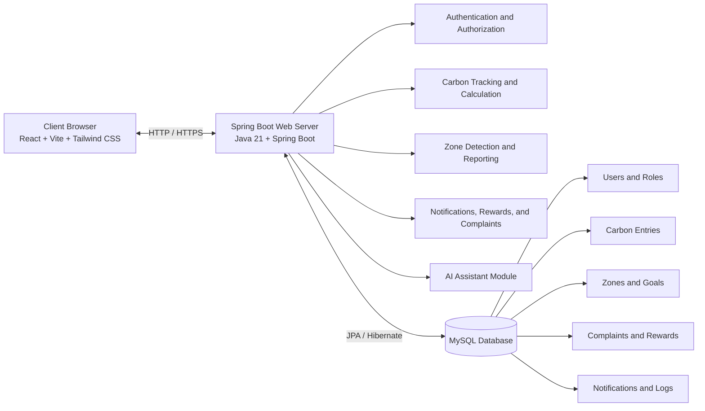

# PROJECT REPORT ON
## CARBONTRACK NEXUS: A CARBON FOOTPRINT MONITORING AND ENVIRONMENTAL IMPACT ANALYTICS SYSTEM

> Formatting note: use the same college cover-page layout, logo placement, certificate wording, font family, font size, margins, and page styling from your reference PDF. This file is the completed project content draft to place into that same report template.

---

# TITLE PAGE

**[Insert the same college logo used in the reference report here]**

**A Project Report Submitted in Partial Fulfillment of the Requirements for the Award of the Degree**

**BACHELOR OF COMPUTER APPLICATIONS / BACHELOR OF COMPUTER SCIENCE**  
*(edit degree name exactly as required by your college)*

**Submitted by**  
`[Student Name]`  
`[Register Number]`

**Under the Guidance of**  
`[Guide Name and Designation]`

**Department of `[Department Name]`**  
`[College Name]`  
`[University / Affiliation Name]`  
`[Academic Year]`

---

# CERTIFICATE

This is to certify that the project work entitled **"CarbonTrack Nexus: A Carbon Footprint Monitoring and Environmental Impact Analytics System"** is a bonafide work carried out by **`[Student Name]`**, Register Number **`[Register Number]`**, in partial fulfillment of the requirements for the award of the degree of **`[Degree Name]`** during the academic year **`[Academic Year]`** under my guidance and supervision.

The work embodied in this project report has not been submitted earlier for the award of any degree or diploma to the best of my knowledge and belief.

**Guide Signature:** ____________________  
**Head of Department:** ____________________  
**Principal:** ____________________  
**Date:** ____________________  
**Place:** ____________________

---

# DECLARATION

I hereby declare that the project report entitled **"CarbonTrack Nexus: A Carbon Footprint Monitoring and Environmental Impact Analytics System"** is the original work carried out by me and submitted in partial fulfillment of the requirements for the award of the degree of **`[Degree Name]`**. The information submitted in this report is true to the best of my knowledge and belief.

I further declare that this work has not been submitted either in part or in full for the award of any other degree, diploma, fellowship, or similar title in any institution.

**Signature of the Student:** ____________________  
**Name:** `[Student Name]`  
**Register Number:** `[Register Number]`

---

# ACKNOWLEDGEMENT

I express my sincere gratitude to the management and faculty members of **`[College Name]`** for providing the opportunity, facilities, and encouragement required to complete this senior project successfully.

I convey my heartfelt thanks to **`[Guide Name]`**, my project guide, for valuable suggestions, continuous support, and constructive feedback throughout the development of this project. The guidance provided helped me shape the idea into a practical and technically sound system.

I also thank the Head of the Department, my teachers, friends, and family members for their encouragement and support during every stage of the project. Their motivation helped me complete the work with confidence and dedication.

---

# ABSTRACT

The **CarbonTrack Nexus: A Carbon Footprint Monitoring and Environmental Impact Analytics System** is a full-stack web application developed to help users track and understand their daily carbon emissions. The system combines personal carbon monitoring, zone-based analysis, goal tracking, rewards, complaint reporting, and an AI-based assistant in a single platform.

The application allows users to register, log daily activities such as electricity usage, fuel consumption, transport, and waste generation, and view the calculated carbon emission in kilograms of CO2. The system presents this data through dashboards, category charts, monthly trends, progress indicators, and downloadable reports. It also supports streaks, missions, and rewards to encourage regular participation.

At the administrative level, the system provides monitoring tools for high emitters, zone-wise analysis, complaint review, and live activity updates. A smart complaint module allows users to report vehicle smoke and waste-dumping issues with media evidence, location details, OCR-based plate detection, AI scoring, and complaint status tracking.

The project is implemented using **React, Vite, Tailwind CSS, Spring Boot, Spring Security, JPA, and MySQL**. JWT is used for secure role-based access, and OTP verification is used for admin login. The system provides a practical approach for combining carbon tracking and environmental reporting in one web-based solution.

---

# TABLE OF CONTENTS

1. Introduction  
2. Problem Definition and Objectives  
3. Background and Existing System Study  
4. Architecture and System Design  
5. Technologies Used  
6. Database Design  
7. Code Implementation  
8. Testing and Validation  
9. Output Screens  
10. Conclusion and Future Scope  
11. Bibliography  
12. Appendix

---

# CHAPTER 1: INTRODUCTION

Climate change, pollution, and unsustainable energy use have become major concerns in recent years. A major reason for this is the **carbon footprint** created by daily activities such as electricity usage, fuel consumption, transport, and waste generation. Even though people are more aware of environmental issues now, many still do not know how much carbon they produce in everyday life.

Most existing carbon calculators are limited to one-time estimation. They usually do not provide continuous tracking, long-term records, personalized suggestions, or location-based analysis. In real life, environmental issues are not only personal but also community-based. Problems such as vehicle smoke, waste dumping, and high-emission areas need proper reporting and monitoring.

This project was developed to address these issues through a single web-based platform that combines **carbon tracking**, **analytics**, **complaint reporting**, and **administrative monitoring**. The system helps users record daily activities, view emission patterns, set reduction goals, and receive useful suggestions. It also helps administrators monitor high emitters, study zone-wise data, and manage complaints more effectively.

This project is suitable as a final-year academic work because it combines frontend development, backend services, database design, security, analytics, and practical problem solving in one meaningful application.

---

# CHAPTER 2: PROBLEM DEFINITION AND OBJECTIVES

## 2.1 Problem Definition

Most individuals and small communities do not have access to a practical system that helps them:

- measure their daily carbon emissions continuously,
- understand which activities contribute the most to their environmental impact,
- compare their usage against meaningful local or zone limits,
- receive personalized improvement guidance,
- and report environmental issues such as smoke-emitting vehicles or waste dumping through a structured digital workflow.

Existing solutions are usually fragmented. Carbon calculators provide estimates, civic complaint systems collect reports, and dashboards may show only high-level data. There is rarely a single system that integrates **user-level tracking**, **community reporting**, **administrative intelligence**, and **behavioral engagement**.

## 2.2 Objectives

The major objectives of the proposed system are:

1. To build a secure web-based platform for recording and analyzing carbon-emitting activities.
2. To calculate carbon emissions using predefined activity-wise emission factors.
3. To provide users with dashboards, breakdown charts, monthly summaries, green scores, and downloadable reports.
4. To support reduction goals, streak tracking, missions, and rewards for sustained eco-friendly behavior.
5. To assign users to geographic zones and compare their emission profile with zone-based targets.
6. To provide an AI-assisted chat module that explains the user's current carbon status and suggests better actions.
7. To enable reporting of local environmental issues such as vehicle smoke and garbage dumping with media evidence.
8. To assist administrators in monitoring high emitters, complaint trends, live activity, and zone-wise environmental conditions.
9. To create a scalable architecture that can be extended with more activity types, analytics, and external data sources in the future.

## 2.3 Scope of the Project

The scope of this project includes:

- user registration, login, and password management,
- role-based access for users and administrators,
- carbon entry logging and category-based emission calculation,
- dashboard and analytics visualizations,
- zone-based tracking and alerts,
- reward, streak, and mission features,
- smart complaint reporting for air pollution and waste dumping,
- monthly CSV report generation,
- admin monitoring and complaint analytics,
- and AI-powered guidance for individual users.

The current version is designed as a web application and focuses mainly on structured tracking and analytics rather than direct IoT integration or large-scale sensor networks.

---

# CHAPTER 3: BACKGROUND AND EXISTING SYSTEM STUDY

Environmental monitoring systems generally fall into three categories:

1. **Basic carbon calculators** that estimate emissions from user-entered values.
2. **Dashboard systems** that summarize aggregate environmental data.
3. **Complaint management systems** that allow citizens to report issues.

While these systems are useful, they often have several limitations:

- they are not personalized over time,
- they do not maintain long-term behavioral records,
- they do not combine personal and community environmental data,
- they lack gamification and motivation features,
- and they rarely include actionable AI guidance.

The proposed project improves on these limitations by introducing a more integrated model. It not only estimates emissions but also stores history, analyzes trends, compares activity with zone thresholds, motivates the user through rewards and streaks, and connects environmental reporting with administrative review.

## 3.1 Need for the Proposed System

There is a growing need for environmental software that is:

- easy for students and ordinary users to operate,
- useful for both individuals and administrators,
- data-driven rather than purely descriptive,
- capable of generating reports,
- and expandable toward smart-city or sustainability use cases.

## 3.2 Key Improvement Areas Over Existing Systems

The proposed system provides the following improvements:

- continuous logging rather than one-time calculation,
- zone-based environmental interpretation,
- goal tracking and reward-based engagement,
- complaint reporting with media evidence,
- vehicle number extraction support,
- role-based dashboards,
- and AI-generated contextual advice.

---

# CHAPTER 4: ARCHITECTURE AND SYSTEM DESIGN

## 4.1 Overall Architecture

The system follows a **three-tier architecture**:

1. **Presentation Layer**  
   Built with React, Vite, and Tailwind CSS. This layer handles user interaction, routing, forms, charts, dashboards, and complaint reporting screens.

2. **Application Layer**  
   Built with Spring Boot. This layer manages authentication, authorization, carbon calculation, zone detection, reporting, notifications, rewards, complaint handling, and AI assistant logic.

3. **Data Layer**  
   Built on MySQL using JPA/Hibernate. This layer stores users, roles, carbon entries, zones, goals, complaints, rewards, notifications, and related transactional records.

## 4.2 Architectural Flow

```text
User / Admin
    |
    v
React Frontend (UI, Forms, Charts, Complaint Capture, Assistant Widget)
    |
    v
REST API Calls through Axios + JWT
    |
    v
Spring Boot Backend
    |- Authentication and OTP verification
    |- Carbon entry processing and analytics
    |- Goal, streak, reward, and notification services
    |- Zone detection and monitoring
    |- Smart complaint management
    |- AI assistant integration
    |
    v
MySQL Database
```

## 4.2.1 Architecture Diagram

The architecture of the system can be represented in both visual and text form for documentation purposes.



For environments where visual rendering is not available, the same architecture can be shown using a simple text diagram:

```text
+---------------------------+        HTTP / HTTPS        +-------------------------------+        JPA / Hibernate        +----------------------+
|       Client Browser      | <-----------------------> |    Spring Boot Web Server     | <-------------------------> |    MySQL Database    |
| React + Vite + Tailwind   |                           | Java 21 + Spring Boot         |                            |        MySQL         |
+---------------------------+                           +-------------------------------+                            +----------------------+
                                                              |        |        |        |        |
                                                              |        |        |        |        |
                                                              v        v        v        v        v
                                                        +---------+ +---------+ +---------+ +---------+ +----------------+
                                                        |  Auth   | | Carbon  | |  Zone   | | Reports | | AI Assistant   |
                                                        | /Roles  | | Tracking| |Detectn. | | & Alert | | Complaints etc.|
                                                        +---------+ +---------+ +---------+ +---------+ +----------------+
```

## 4.3 Major Functional Modules

### 4.3.1 User Module

The user module includes:

- registration and login,
- daily carbon entry logging,
- dashboard and category breakdown,
- monthly report download,
- green score calculation,
- recommendations and emission prediction,
- monthly reduction goals,
- streak and reward tracking,
- AI assistant support,
- and personal complaint reporting.

### 4.3.2 Admin Module

The admin module includes:

- secure admin login with OTP,
- total users and zone statistics,
- high emitter monitoring,
- zone-based emission reports,
- live feed and threshold alerts,
- complaint analytics,
- and notification broadcasting.

### 4.3.3 Community / Complaint Module

This module allows users to:

- report vehicle emission complaints,
- report waste-dumping complaints,
- attach image or video evidence,
- auto-fill location and mapped zone,
- detect number plates through OCR,
- receive AI-derived severity and confidence values,
- and track complaint status changes.

## 4.4 Security Design

The application uses **JWT-based stateless authentication**. Public routes are limited to login, registration, admin OTP verification, and location-related endpoints. User routes require `ROLE_USER`, while administrator routes require `ROLE_ADMIN`. Passwords are encrypted using **BCrypt**.

Admin login includes an additional OTP verification layer. The login module also contains failed-login tracking and temporary rate limiting to reduce repeated unauthorized attempts.

## 4.5 Zone-Based Logic

Zones are initialized in the system using geographic latitude and longitude boundaries. During registration, login updates, or complaint creation, user coordinates can be used to map the user or issue into a predefined zone. This helps the system compare personal emissions with regional limits and generate zone-level analytics.

## 4.6 Carbon Calculation Logic

The core calculation rule used in the system is:

```text
Carbon Emission (kg CO2) = Activity Quantity x Emission Factor
```

The backend service maps each activity type to an emission factor. Examples include electricity, petrol, diesel, bus travel, train travel, flights, LPG, and industrial inputs such as coal, cement, steel, and industrial waste.

## 4.7 Behavioral Engagement Design

To improve user retention and encourage positive habits, the system includes:

- reward points for daily logging and issue reporting,
- streak tracking,
- weekly goal progress,
- milestone badges,
- and challenge-oriented visual feedback.

These features transform the system from a simple calculator into an engagement-oriented sustainability platform.

---

# CHAPTER 5: TECHNOLOGIES USED

## 5.1 Frontend Technologies

| Technology | Purpose |
|---|---|
| React 18 | Component-based UI development |
| Vite 5 | Fast frontend build tool and development server |
| Tailwind CSS 3 | Utility-first styling and responsive design |
| React Router v6 | Client-side routing |
| Axios | API communication |
| React Hook Form + Zod | Form handling and validation |
| Recharts | Chart and graph visualization |
| Framer Motion | UI animations |
| Leaflet / React-Leaflet | Map-based presentation |
| React Hot Toast | Notifications and alerts |

## 5.2 Backend Technologies

| Technology | Purpose |
|---|---|
| Java 21 | Core backend language |
| Spring Boot 3.2.2 | Application framework |
| Spring Web | REST API creation |
| Spring Data JPA | ORM and database access |
| Spring Security | Authentication and authorization |
| JWT | Token-based security |
| BCrypt | Password hashing |
| Spring Mail | Email and OTP delivery |
| Springdoc OpenAPI | API documentation support |

## 5.3 Database

| Technology | Purpose |
|---|---|
| MySQL | Persistent relational data storage |
| Hibernate / JPA | Entity mapping and query handling |

## 5.4 Development Concepts Used

- RESTful API design  
- role-based authorization  
- responsive user interface design  
- reusable component architecture  
- structured data modeling  
- event and reward tracking  
- geolocation-based zone mapping  
- CSV export generation  
- AI-assisted response generation

---

# CHAPTER 6: DATABASE DESIGN

The database is designed in a modular way so that user records, activity logs, goals, complaints, notifications, and rewards can be managed independently while still remaining connected through relationships.

## 6.1 Main Tables

| Table Name | Purpose |
|---|---|
| `users` | Stores user profile, address, coordinates, sector data, role, and zone mapping |
| `role` | Stores role definitions such as `ROLE_USER` and `ROLE_ADMIN` |
| `carbon_entry` | Stores activity-wise emission entries created by users |
| `zones` | Stores zone names, coordinate ranges, and emission thresholds |
| `environmental_issue` | Stores complaint reports for air pollution and waste dumping |
| `issue_vote` | Stores upvotes for community complaints |
| `issue_follower` | Stores complaint followers |
| `issue_status_history` | Tracks complaint status changes over time |
| `notification` | Stores user and admin notification messages |
| `reward_event` | Stores points awarded for actions such as daily logging and reporting |
| `user_monthly_goal` | Stores target reduction percentage and weekly-summary settings |
| `user_streak` | Stores streak-related information |
| `user_daily_check_in` | Stores daily participation records |
| `user_mission` | Stores mission progress information |
| `quick_entry_template` | Stores reusable carbon-entry shortcuts for users |
| `password_reset_token` | Stores password reset tokens and expiry |
| `high_emitter_alert` | Stores high-emission alert status for admin review |
| `admin_activity_log` | Stores admin action history |

## 6.2 Important Relationships

- One role can be assigned to many users.
- One zone can contain many users.
- One user can create many carbon entries.
- One user can create many complaints.
- One complaint can have many votes, followers, and status-history entries.
- One user can receive many notifications.
- One user can earn many reward events.

## 6.3 Key Entity Fields

### User

- `id`
- `name`
- `email`
- `password`
- `address`
- `latitude`
- `longitude`
- `role_id`
- `zone_id`
- `sectorCategory`
- `sectorType`

### Carbon Entry

- `id`
- `activityType`
- `quantity`
- `carbonAmount`
- `co2Amount`
- `date`
- `createdAt`
- `user_id`

### Environmental Issue

- `id`
- `title`
- `description`
- `issueType`
- `severity`
- `latitude`
- `longitude`
- `address`
- `mappedZoneName`
- `mediaType`
- `detectionModel`
- `vehiclePlateNumber`
- `aiScore`
- `aiConfidenceScore`
- `estimatedCarbonGrams`
- `status`
- `reportedAt`
- `resolvedAt`
- `reporter_id`

## 6.4 Database Design Advantages

The chosen design provides the following benefits:

- normalization of major functional records,
- easy expansion for future modules,
- strong mapping between user, zone, and complaint data,
- support for analytics queries,
- and clean service-level separation for business logic.

## 6.5 Database Screens to Be Added

Database screenshots can be added to show that the system is connected to a real relational database and that the main modules store proper records.

The screenshots can be taken from MySQL Workbench, phpMyAdmin, or any similar tool used during development. Only the important tables need to be shown, and the table names and column names should be clearly visible.

### Recommended Database Screenshots

1. Complete database schema or table list
2. `users` table structure or sample records
3. `carbon_entry` table sample records
4. `environmental_issue` table sample records
5. `zones` table sample records
6. `reward_event` or `user_monthly_goal` table sample records
7. ER diagram or relationship diagram if available

## 6.6 Database Screenshot Placeholders

### Database Schema Overview

Capture:

- database name,
- major tables,
- overall schema visibility.

**[Paste DB Screenshot Here: Database schema or table list]**

Caption: **Figure DB-1: Database Schema of CarbonTrack Nexus**

### Users Table

Capture:

- user ID,
- name,
- email,
- role mapping,
- zone or profile-related fields.

**[Paste DB Screenshot Here: `users` table]**

Caption: **Figure DB-2: User Master Table**

### Carbon Entry Table

Capture:

- activity type,
- quantity,
- carbon amount,
- date,
- user reference.

**[Paste DB Screenshot Here: `carbon_entry` table]**

Caption: **Figure DB-3: Carbon Entry Transaction Table**

### Environmental Issue Table

Capture:

- complaint title or type,
- severity,
- mapped zone,
- AI score,
- complaint status,
- reporter mapping.

**[Paste DB Screenshot Here: `environmental_issue` table]**

Caption: **Figure DB-4: Environmental Complaint Table**

### Zones Table

Capture:

- zone names,
- threshold values,
- geographic or range fields if present.

**[Paste DB Screenshot Here: `zones` table]**

Caption: **Figure DB-5: Zone Configuration Table**

### Goal, Reward, or Streak Table

Capture one of the following, based on which table has better data:

- `reward_event`,
- `user_monthly_goal`,
- `user_streak`,
- or `user_mission`.

**[Paste DB Screenshot Here: goal, reward, or streak table]**

Caption: **Figure DB-6: User Progress and Reward Tracking Table**

### ER Diagram or Relationship View

If the database tool supports relationship diagrams, one figure may be included to illustrate the relationship among users, carbon entries, complaints, zones, and rewards.

**[Paste DB Screenshot Here: ER diagram or relationships]**

Caption: **Figure DB-7: Entity Relationship View of the Database**

## 6.7 Database Screenshot Tips

- include only meaningful, data-filled tables,
- avoid displaying sensitive passwords or confidential values,
- ensure that column names remain clearly readable,
- and maintain a balanced selection of approximately 4 to 7 database screenshots.

---

# CHAPTER 7: CODE IMPLEMENTATION

This chapter is arranged so that code screenshots can be added directly into the report. For each section, only the most important part of the code should be captured clearly.

## 7.1 Frontend Navigation and Route Protection

The application route structure is implemented in `carbon-footprint-frontend/carbon-footprint-frontend/src/App.jsx`. This file shows how the project separates public pages, normal-user pages, and administrator pages using dedicated protected-route wrappers.

Insert a screenshot showing:

- `GuestRoute`, `UserRoute`, and `AdminRoute`,
- public routes such as landing, login, and register,
- user routes such as dashboard, add entry, report, leaderboard, and complaints,
- admin routes such as dashboard, users, high emitters, complaints, and analytics.

**[Paste Code Screenshot Here: `src/App.jsx` route configuration]**

## 7.2 Security Configuration and Access Control

Backend access control is configured in `carbon-footprint-backend/src/main/java/com/bca/carbonfootprint/config/SecurityConfig.java`. This file is important because it demonstrates JWT-based stateless security, CORS configuration, and role-based authorization for API endpoints.

Insert a screenshot showing:

- `securityFilterChain(...)`,
- public endpoint permissions,
- admin endpoint protection,
- user endpoint protection,
- JWT filter attachment before username-password authentication.

**[Paste Code Screenshot Here: `SecurityConfig.java` security rules]**

## 7.3 Authentication, Login, and OTP Verification

The authentication workflow is implemented in `carbon-footprint-backend/src/main/java/com/bca/carbonfootprint/controller/AuthController.java`. This module handles registration, login, OTP verification, password reset support, and failed-login rate limiting.

Insert a screenshot showing:

- `/register`,
- `/login`,
- admin OTP generation flow,
- `/verify-otp`,
- failed-attempt tracking or rate-limit logic.

**[Paste Code Screenshot Here: `AuthController.java` authentication flow]**

## 7.4 Carbon Entry Processing and Emission Calculation

Carbon entry logic is implemented in `carbon-footprint-backend/src/main/java/com/bca/carbonfootprint/service/impl/CarbonEntryServiceImpl.java`. This is one of the most important backend files because it converts activity input into carbon values and then updates related system features.

Insert a screenshot showing:

- `addEntry(...)`,
- `calculateCarbon(...)`,
- monthly emission lookup,
- alert or notification trigger,
- reward or mission update after saving an entry.

### Example Emission Factors Used in the Code

| Activity Type | Factor Used |
|---|---|
| ELECTRICITY | `0.82` |
| LPG | `3.0` |
| DIESEL | `2.68` |
| PETROL | `2.31` |
| CNG | `2.75` |
| CAR | `0.21` |
| BIKE | `0.08` |
| BUS | `0.105` |
| TRAIN | `0.041` |
| FLIGHT | `0.255` |
| AC | `1.5` |
| COAL | `2.4` |
| CEMENT | `0.93` |
| STEEL | `1.85` |
| WASTE | `0.5` |
| INDUSTRIAL_WASTE | `1.2` |

**[Paste Code Screenshot Here: `CarbonEntryServiceImpl.java` calculation and save logic]**

## 7.5 Goal Tracking and Weekly Progress Logic

Goal computation is implemented in `carbon-footprint-backend/src/main/java/com/bca/carbonfootprint/service/GoalTrackingService.java`. This service calculates reduction targets, baseline comparison, monthly progress, and scheduled weekly summaries.

Insert a screenshot showing:

- `getProgress(...)` or `updateSettings(...)`,
- baseline and target calculation,
- progress percentage logic,
- weekly-summary scheduling.

**[Paste Code Screenshot Here: `GoalTrackingService.java` goal calculation logic]**

## 7.6 Smart Complaint Capture and Analysis

The complaint feature is implemented across frontend and backend. The frontend page is `carbon-footprint-frontend/carbon-footprint-frontend/src/pages/user/SmartComplaints.jsx`, and backend complaint processing is handled in `carbon-footprint-backend/src/main/java/com/bca/carbonfootprint/controller/CommunityController.java`.

For the frontend screenshot, include:

- complaint mode selection,
- state variables for media, OCR, and analysis,
- helper usage for complaint analysis.

For the backend screenshot, include:

- `/issues` creation logic,
- validation,
- issue rate limiting,
- zone mapping,
- AI score or evidence metadata storage.

**[Paste Code Screenshot Here: `SmartComplaints.jsx` complaint UI logic]**

**[Paste Code Screenshot Here: `CommunityController.java` complaint creation logic]**

## 7.7 AI Assistant Integration

The AI-powered personal assistant is implemented in `carbon-footprint-backend/src/main/java/com/bca/carbonfootprint/service/PersonalCarbonAssistantService.java`. This file shows how the system prepares the prompt, sends a request to a configured model endpoint, and falls back safely if the model is unavailable.

Insert a screenshot showing:

- model configuration values,
- prompt-building logic,
- request payload construction,
- API call,
- fallback handling.

**[Paste Code Screenshot Here: `PersonalCarbonAssistantService.java` AI integration]**

## 7.8 Admin Dashboard and Monitoring Logic

The admin monitoring screen is implemented in `carbon-footprint-frontend/carbon-footprint-frontend/src/pages/admin/AdminDashboard.jsx`. This file is useful for demonstrating how the project presents system-wide insights to administrators through live cards, charts, and feed data.

Insert a screenshot showing:

- dashboard API calls,
- live monitor refresh behavior,
- stat cards,
- chart data preparation,
- activity feed rendering.

**[Paste Code Screenshot Here: `AdminDashboard.jsx` admin monitoring UI]**

## 7.9 Optional Additional Code Screens

If your college report requires more implementation screenshots, the following files are also strong choices:

| Priority | File | Reason to Capture |
|---|---|---|
| 1 | `src/components/layout/ProtectedRoute.jsx` | Shows frontend route authorization |
| 2 | `src/pages/user/UserDashboard.jsx` | Shows user dashboard metrics and charts |
| 3 | `src/pages/user/MonthlyReport.jsx` | Shows report and export flow |
| 4 | `src/pages/user/StreakCenter.jsx` | Shows streak, mission, and reward logic |
| 5 | `src/main/java/com/bca/carbonfootprint/config/ZoneInitializer.java` | Shows predefined zone initialization |
| 6 | `src/main/java/com/bca/carbonfootprint/controller/AdminController.java` | Shows admin APIs and monitoring endpoints |

Presentation note:

- keep the editor zoom between 125 percent and 150 percent,
- capture one logical code block per image,
- ensure that method names and annotations are clearly readable,
- and avoid overcrowding a single page with too many screenshots.

---

# CHAPTER 8: TESTING AND VALIDATION

## 8.1 Testing Approach

Testing for this project was carried out through a combination of:

- functional validation of major modules,
- frontend build verification,
- backend framework test support,
- API-level behavior checks during development,
- and manual UI testing for user and admin workflows.

## 8.2 Major Test Scenarios

| Test Scenario | Expected Result |
|---|---|
| User registration | New user account should be created successfully |
| User login | Valid credentials should return JWT and user details |
| Admin login with OTP | OTP should be required before final token issuance |
| Add carbon entry | Carbon amount should be calculated and saved correctly |
| Dashboard view | Monthly and daily metrics should load correctly |
| Category breakdown | Chart data should reflect stored entries |
| Goal update | Updated reduction target should be saved and reflected in progress |
| Monthly report export | CSV file should download with activity and total values |
| Complaint creation | Complaint should be stored with status and metadata |
| Complaint status update | Admin should be able to change issue status and keep history |
| Role-based access | Users should be blocked from admin routes and vice versa |
| Notification flow | Relevant alerts should be visible to intended users |

## 8.3 Validation Notes from the Current Workspace

- The frontend production build was executed successfully in this workspace on **April 3, 2026** using `npm.cmd run build`.
- The build completed successfully and generated a production bundle under the frontend `dist` folder.
- The build output also reported a large JavaScript chunk warning, which suggests future optimization through code splitting.
- The backend project includes Spring Boot test infrastructure and existing `surefire-reports` artifacts in the repository, indicating prior automated test execution.
- A fresh backend test rerun could not be completed in this shell because the Maven wrapper invocation failed before project execution, so that part should be treated as an environment limitation rather than a confirmed application failure.

## 8.4 Observed Strengths

- The project covers both normal-user and admin workflows.
- Security rules are clearly separated by role.
- Carbon logic, goals, rewards, and complaint workflows are implemented as distinct service units.
- The frontend has a buildable production output.

## 8.5 Current Limitations

- Automated backend test coverage is limited in the present codebase.
- Large frontend bundle size may affect loading performance.
- The complaint analysis logic is helper-driven and can be improved with more advanced real-world ML models.
- Zone definitions are static and currently initialized through configured coordinate ranges.

## 8.6 Demonstration Readiness Checklist

Before taking the final screenshots or giving the project demonstration, the following preparation is recommended:

- keep one normal-user account and one admin account ready,
- keep geolocation permission enabled in the browser,
- create a few carbon entries in different categories so charts are not empty,
- keep at least one complaint in `REPORTED` status and one in `RESOLVED` status,
- set one monthly goal so the streak and progress section looks active,
- keep leaderboard and zone report pages populated with test data,
- and verify that the assistant panel opens with a meaningful response.

## 8.7 API Documentation and Swagger Testing

The backend includes Swagger/OpenAPI support through Springdoc. This helps in documenting the APIs and showing API-level testing in the project report.

The Swagger UI can generally be accessed at:

- `http://localhost:8080/swagger-ui/index.html`

The OpenAPI JSON document is typically available at:

- `http://localhost:8080/v3/api-docs`

The OpenAPI configuration is defined in `carbon-footprint-backend/src/main/java/com/bca/carbonfootprint/config/OpenApiConfig.java`, where the API title, version, description, and bearer-token security scheme are configured.

### Recommended Swagger Screenshots

1. Swagger home screen showing available API groups and endpoints
2. User registration API test
3. User login API test
4. Add carbon entry API test
5. Complaint creation API test
6. Admin dashboard or analytics API test
7. Authorized JWT testing view if visible

## 8.8 Swagger Screenshot Placeholders

### Swagger Home Screen

Insert a screenshot showing:

- project API title,
- available endpoint sections,
- authorize button if visible.

**[Paste Swagger Screenshot Here: Swagger home screen]**

Caption: **Figure API-1: Swagger API Documentation Home Screen**

### Registration API Test

Use:

- `POST /api/auth/register`

Insert a screenshot showing:

- request body,
- execute result,
- success response.

**[Paste Swagger Screenshot Here: Register API test]**

Caption: **Figure API-2: User Registration API Testing**

### Login API Test

Use:

- `POST /api/auth/login`

Insert a screenshot showing:

- request payload,
- response token or success message,
- response code.

**[Paste Swagger Screenshot Here: Login API test]**

Caption: **Figure API-3: User Login API Testing**

### Carbon Entry API Test

Use:

- `POST /api/carbon/add`
- or `GET /api/carbon/breakdown`

Insert a screenshot showing:

- authorized JWT call,
- request body,
- response data.

**[Paste Swagger Screenshot Here: Carbon API test]**

Caption: **Figure API-4: Carbon Entry and Analytics API Testing**

### Complaint API Test

Use:

- `POST /api/community/issues`
- or `GET /api/community/issues/mine`

Insert a screenshot showing:

- issue request data,
- complaint response body,
- status or metadata returned.

**[Paste Swagger Screenshot Here: Complaint API test]**

Caption: **Figure API-5: Smart Complaint API Testing**

### Admin API Test

Use any one of the following:

- `GET /api/admin/dashboard`
- `GET /api/admin/high-emitters`
- `GET /api/admin/complaints/analytics`
- `GET /api/admin/live-monitor`

Insert a screenshot showing:

- authorized admin call,
- returned analytics data,
- response code.

**[Paste Swagger Screenshot Here: Admin API test]**

Caption: **Figure API-6: Admin Monitoring API Testing**

## 8.9 API Testing Notes

While capturing Swagger screenshots:

- click `Authorize` and paste the JWT token for protected endpoints,
- use working sample data so the response section is not empty,
- include both request and response in the screenshot where possible,
- and keep around 4 to 6 API screenshots for balanced documentation.

---

# CHAPTER 9: OUTPUT SCREENS

This chapter is arranged so that website screenshots can be inserted directly into the report. The same placement style used in the reference report may be followed, but the captions should match this project.

## 9.1 Home or Landing Page

Open the website home page `/` and capture:

- project title and tagline,
- hero banner,
- login or register call-to-action buttons,
- any key feature highlights visible above the fold.

**[Paste Website Screenshot Here: Landing page]**

Caption: **Figure 1: Home Page of CarbonTrack Nexus**

## 9.2 User Registration Page

Open `/register` and capture:

- registration form,
- input fields,
- validation or supporting text,
- clean full-page layout.

**[Paste Website Screenshot Here: Registration page]**

Caption: **Figure 2: User Registration Interface**

## 9.3 User Login Page

Open `/login` and capture:

- login form,
- email and password fields,
- sign-in action button,
- forgot-password option if visible.

**[Paste Website Screenshot Here: User login page]**

Caption: **Figure 3: User Login Interface**

## 9.4 User Dashboard

Open `/dashboard` and capture:

- monthly carbon summary,
- today's emission,
- charts or breakdown cards,
- budget, score, or comparison widgets.

**[Paste Website Screenshot Here: User dashboard]**

Caption: **Figure 4: User Carbon Dashboard**

## 9.5 Add Carbon Entry Page

Open `/add-entry` and capture:

- activity selection,
- quantity input,
- estimated or resulting carbon value,
- submit action area.

**[Paste Website Screenshot Here: Add entry page]**

Caption: **Figure 5: Carbon Entry Submission Screen**

## 9.6 Monthly Report or Entry History Page

Open `/monthly-report` or `/my-entries` and capture:

- report table or activity list,
- month-based filtering if available,
- export or download option.

**[Paste Website Screenshot Here: Monthly report or entries page]**

Caption: **Figure 6: Monthly Emission Report Screen**

## 9.7 Leaderboard Page

Open `/leaderboard` and capture:

- user ranking list,
- score or points,
- comparative performance details.

**[Paste Website Screenshot Here: Leaderboard page]**

Caption: **Figure 7: Leaderboard and Comparative Ranking**

## 9.8 Streak, Goal, or Reward Page

Open `/streaks` and capture:

- streak counter,
- monthly goal progress,
- rewards, missions, or badges,
- any visual progress indicators.

**[Paste Website Screenshot Here: Streak and reward page]**

Caption: **Figure 8: Goal, Streak, and Reward Tracking Interface**

## 9.9 AI Assistant Section

Open the user dashboard section where the assistant appears and capture:

- Carbon Copilot panel,
- one sample question and response if possible,
- recommendation or insight card.

**[Paste Website Screenshot Here: AI assistant section]**

Caption: **Figure 9: Carbon Copilot Assistant Interface**

## 9.10 Smart Complaint Reporting Page

Open `/smart-complaints` and capture:

- complaint type selection,
- camera or upload section,
- location or plate-detection elements,
- submit complaint form.

**[Paste Website Screenshot Here: Smart complaint form]**

Caption: **Figure 10: Smart Complaint Reporting Module**

## 9.11 Complaint History or My Issues Section

On the same complaint page or complaint history area, capture:

- previously submitted complaints,
- status labels,
- timeline or evidence summary if shown.

**[Paste Website Screenshot Here: Complaint history section]**

Caption: **Figure 11: Complaint Tracking and Status History**

## 9.12 Admin Dashboard

Open `/admin/dashboard` and capture:

- total users,
- high emitters count,
- live activity section,
- charts and monitoring cards.

**[Paste Website Screenshot Here: Admin dashboard]**

Caption: **Figure 12: Administrative Dashboard Overview**

## 9.13 High Emitters Page

Open `/admin/high-emitters` and capture:

- high-emitter list,
- alert values,
- user-wise monitoring table or cards.

**[Paste Website Screenshot Here: High emitters page]**

Caption: **Figure 13: High Emitter Monitoring Screen**

## 9.14 Zone Report or Zone Analytics Page

Open `/admin/zone-report` and capture:

- zone-wise totals,
- chart or table summary,
- threshold or comparison indicators.

**[Paste Website Screenshot Here: Zone report page]**

Caption: **Figure 14: Zone-Based Emission Analysis Screen**

## 9.15 Complaint Analytics or Admin Complaint Center

Open `/admin/complaints` or `/admin/analytics` and capture:

- complaint statistics,
- issue categories,
- status distribution,
- admin review controls if visible.

**[Paste Website Screenshot Here: Complaint analytics page]**

Caption: **Figure 15: Complaint Analytics and Monitoring Screen**

## 9.16 Recommended Screenshot Selection Strategy

If the report has limited space, the following screenshots can be treated as the highest priority:

1. User dashboard
2. Add carbon entry page
3. Streak and goal page
4. Smart complaint reporting page
5. Admin dashboard
6. Zone report page

Additional presentation suggestions:

- use full-screen browser capture rather than cropped mobile view,
- keep browser zoom around 90 percent to 100 percent,
- avoid screenshots with empty tables or blank charts,
- and use screens with proper sample data so the report looks complete.

---

# CHAPTER 10: CONCLUSION AND FUTURE SCOPE

The **CarbonTrack Nexus: A Carbon Footprint Monitoring and Environmental Impact Analytics System** shows how a web application can be used to solve practical environmental problems. The project combines carbon tracking, environmental analytics, complaint management, admin monitoring, and AI-assisted guidance in one platform. Instead of working like a simple calculator, the system supports continuous tracking, analysis, reporting, and decision-making.

From an academic point of view, the project demonstrates important software engineering concepts such as modular design, secure authentication, database management, data visualization, and service-based backend logic. It also shows how technology can be used to support environmental awareness and civic participation.

### Future Scope

The project can be extended in several valuable ways:

- integration with real sensor or IoT pollution data,
- mobile application support,
- real-time map overlays for complaint hotspots,
- machine learning models trained on actual image and video datasets,
- multilingual assistant support,
- predictive analytics for seasonal emission forecasting,
- integration with public sustainability programs or smart-city dashboards,
- and advanced report generation in PDF format with charts and signatures.

In conclusion, the project provides a useful and scalable base for digital environmental monitoring and can be extended further in future versions.

---

# CHAPTER 11: BIBLIOGRAPHY

1. Spring Boot Reference Documentation.
2. Spring Security Reference Documentation.
3. React Documentation.
4. Vite Documentation.
5. Tailwind CSS Documentation.
6. MySQL Reference Manual.
7. OpenAPI Specification Documentation.
8. IPCC Assessment Reports on Climate Change.
9. Greenhouse Gas Protocol Standards and Guidelines.
10. General studies and reference materials on carbon footprint estimation and urban environmental monitoring.

---

# APPENDIX

## Appendix A: Suggested Pages to Keep Same as the Reference Report

- cover page,
- certificate page,
- declaration page,
- acknowledgement page,
- table of contents page,
- chapter heading style,
- page numbering style,
- font family and text size,
- and college logo placement.

## Appendix B: Suggested Project Title Variants

Use the title that best matches your department requirement:

1. **CarbonTrack Nexus: A Carbon Footprint Monitoring and Environmental Impact Analytics System**
2. **Carbon Footprint Monitoring System**
3. **Environmental Impact Analytics System**
4. **Smart Carbon Monitoring and Civic Environmental Reporting System**

## Appendix C: Final Formatting Checklist

- Replace placeholders for student, guide, college, department, and academic year.
- Insert the exact same college logo from the sample report.
- Match title-page text alignment to the sample PDF.
- Apply the same body font size and paragraph spacing used by your college format.
- Insert actual project screenshots in Chapters 6, 7, 8, and 9.
- Add signature blocks where required by your college.
- Generate the final document in the same page size and margin format as the sample report.
